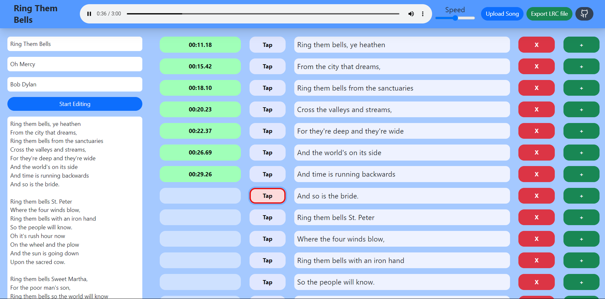

A nice tool for creating [LRC files](https://en.wikipedia.org/wiki/LRC_%28file_format%29). 
(LRC (short for LyRiCs) is a computer file format that synchronizes song lyrics with an audio file, such as MP3, Vorbis or MIDI. Wikipedia)
## Start
First, run the server:
```bash
npm run build
npm run start
```
## Example
```md

```
And this is the LRC file created.
```
[ti:Darkness]
[length:04:29.37]
[00:29.33]I caught the darkness
[00:34.76]It was drinking from your cup
[00:38.77]I caught the darkness
[00:44.48]Drinking from your cup
[00:48.85]I said, "Is this contagious?"
[00:52.59]You said, "Just drink it up."
...
...
...
```
